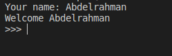
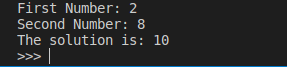

# Variables & Input

## What we learnt
1. How to make a variable and assign data in it
2. How to use variable in production
3. How to input value and assign it in a variable
4. How to convert the the input type to int (number)

---

## Tasks
This time we have 2 tasks  
First one in [welcoming.py](welcoming.py) and the second one in [adding.py](adding.py)

### Welcome a User
By using the input; welcome a new user in the console. In [welcoming.py](welcoming.py)  

You have to welcome them with their name!  
The output must be looking like this:

### Adding Two Numbers together
Now make an app that inputs two numbers from the user then add them together in [adding.py](adding.py)  

for example:  

---

> Good Luck

