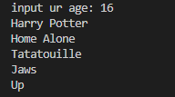

# Looping & Arrays

We learnt how to make the `while` loop and the `for` loop, and how to loop over an array with the `for..in`.

We'll have a task for the arrays and other for the looping.

---

## Tasks

### 1 - Get the even numbers
In [even-numbers.py](even-numbers.py) you'll find a cupple of numbers in an array  
You can to loop over them and only print out the even numbers `(You'll need to use loops and conditions)`  

### 2 - Movies that matchs
In [movie-suggestions.py](movie-suggestions.py) you'll find a cupple of movies, what you have to do is making an input that takes the age from the user, and loop in the list to output only the movies they can watch.  

Example:  

> Good luck