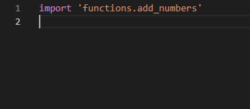
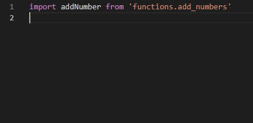

# Functions

Now we almost finished learning Python, so this task will be different, this time we'll make an entire project from scratch.

---

## Setup your project

We'll make a game, the game name will be **`Cows & Bulls`**  
Let's make the repository on [GitHub](https://github.com)  

### Setup repository
- Login to your account, hover your account avatar and click `new repository`
- Name the project
- Copy the HTTP link of the repository
- clone the project on your computer
    - Open the **git bash** in the folder you want to put the project folder in, for example `projects`
    - Use the command `git clone [the link]`
- Setup the folders adn files
    - Add `main.py` file
    - Make a folder called `functions` to add the functions needed for the project in it 
- push the changes to the remote repository
    - use the command `git commit -m "Setup project"`
    - Then do `git push origin main`

---

### Start with the project

We'll use the `main.py` file for the main running project  
And add any function to a file in the functions folder with its name.

We have to use the keyword `import` to addd the other functions in our main file.  

also better to use `from` too   

`You don't need to add .py in the end of any import`

---

## The task

The cows & bulls game is a game where you have a number from 4 digits, that the user have to guess.  
The game have to let the user input values of 4 numbers and check if there's right values in it, if there's you have to give the user a cow, if the value was not right give the user a bull.

and output them, and if the user didn't get 4 cows (win) then they repeat the process again till they succeed.  

If you found anything un-clear please contact [AbdelrahmanDwedar](https://github.com/AbdelrahmanDwedar)

---

> Good luck
