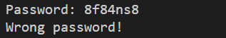
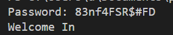
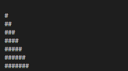

# Moving to C 

In this lesson we leant how to use C language in general and convorted out code to it.  
**Let's practice it more**  

---

## Tasks

### 1 - Password Checker

This is a simple task, just make a password saved in the code.  
Then make an input and check if they match, if so welcome the user, if not then tell them it's a wrong password.  

Build your app in [password-checker](password-checker.c)

#### for example:  

**wrong**  
  

**true**  

### 2 - Make a Pattern Maker

What is pattern maker?  
- It's an app that you give a spesific number and it makes a pattern with that number  
for example:  

> Good luck